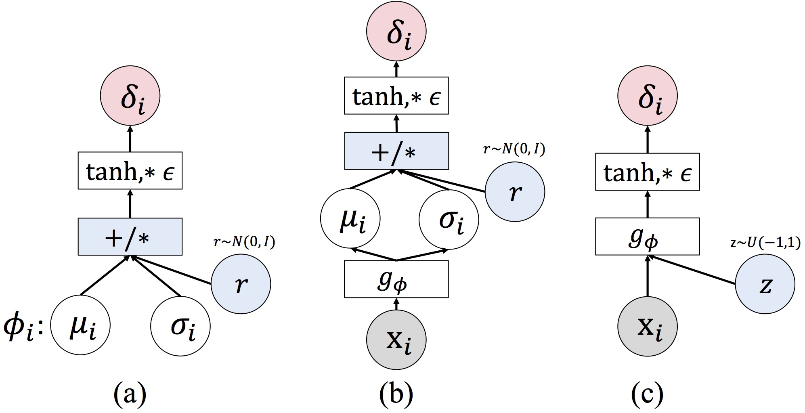

# Adversarial Distributional Training

This repository contains the code for **adversarial distributional training (ADT)** introduced in the following paper

[Adversarial Distributional Training for Robust Deep Learning](https://arxiv.org/abs/2002.05999) (NeurIPS 2020)

[Yinpeng Dong](http://ml.cs.tsinghua.edu.cn/~yinpeng)\*, [Zhijie Deng](http://ml.cs.tsinghua.edu.cn/~zhijie)\*, [Tianyu Pang](http://ml.cs.tsinghua.edu.cn/~tianyu), [Hang Su](http://www.suhangss.me), and [Jun Zhu](http://ml.cs.tsinghua.edu.cn/~jun/index.shtml) (\* indicates equal contribution)

### Citation
If you find our methods useful, please consider citing:

	@inproceedings{dong2020adversarial,
	  title={Adversarial Distributional Training for Robust Deep Learning},
	  author={Dong, Yinpeng and Deng, Zhijie and Pang, Tianyu and Su, Hang and Zhu, Jun},
	  booktitle={Advances in Neural Information Processing Systems},
	  year={2020}
	}


## Introduction
Adversarial distribution training (ADT) is a new framework to train robust deep learning models. It is formulated as a minimax optimization problem, in which the inner maximization aims to find an **adversarial distribution** for each natural input to characterize potential adversarial examples; and the outer minimization aims to optimize DNN parameters with the worst-case adversarial distributions.

In this paper, we proposed three different approaches to parameterize the adversarial distributions, as illustrated below. 



Figure 1: An illustration of three different ADT methods, including (a) ADT<sub>EXP</sub>; (b) ADT<sub>EXP-AM</sub>; (c) ADT<sub>IMP-AM</sub>.


## Prerequisites
* Python (3.6.8)
* Pytorch (1.3.0)
* torchvision (0.4.1)
* numpy

## Training

We have proposed three different methods for ADT. The command for each training method is specified below.

### Training ADT<sub>EXP</sub>

```
python adt_exp.py --model-dir adt-exp --dataset cifar10 (or cifar100/svhn)
```

### Training ADT<sub>EXP-AM</sub>

```
python adt_expam.py --model-dir adt-expam --dataset cifar10 (or cifar100/svhn)
```

### Training ADT<sub>IMP-AM</sub>

```
python adt_impam.py --model-dir adt-impam --dataset cifar10 (or cifar100/svhn)
```

The checkpoints will be saved at each model folder.

## Evaluation

### Evaluation under White-box Attacks

- For FGSM attack, run

```
python evaluate_attacks.py --model-path ${MODEL-PATH} --attack-method FGSM --dataset cifar10 (or cifar100/svhn)
```

- For PGD attack, run

```
python evaluate_attacks.py --model-path ${MODEL-PATH} --attack-method PGD --num-steps 20 (or 100) --dataset cifar10 (or cifar100/svhn)
```

- For MIM attack, run

```
python evaluate_attacks.py --model-path ${MODEL-PATH} --attack-method MIM --num-steps 20 --dataset cifar10 (or cifar100/svhn)
```

- For C&W attack, run

```
python evaluate_attacks.py --model-path ${MODEL-PATH} --attack-method CW --num-steps 30 --dataset cifar10 (or cifar100/svhn)
```

- For FeaAttack, run

```
python feature_attack.py --model-path ${MODEL-PATH} --dataset cifar10 (or cifar100/svhn)
```


### Evaluation under Transfer-based Black-box Attacks

First change the `--white-box-attack` argument in `evaluate_attacks.py` to `False`. Then run

```
python evaluate_attacks.py --source-model-path ${SOURCE-MODEL-PATH} --target-model-path ${TARGET-MODEL-PATH} --attack-method PGD (or MIM)
```

### Evaluation under SPSA

```
python spsa.py --model-path ${MODEL-PATH} --samples_per_draw 256 (or 512/1024/2048)
```

## Pretrained Models

We have provided the pre-trained models on CIFAR-10, whose performance is reported in Table 1. They can be downloaded at 

+ ADT<sub>EXP</sub>: [http://ml.cs.tsinghua.edu.cn/~yinpeng/downloads/ADT-models/adt-exp.pt](http://ml.cs.tsinghua.edu.cn/~yinpeng/downloads/ADT-models/adt-exp.pt)
+ ADT<sub>EXP-AM</sub>: [http://ml.cs.tsinghua.edu.cn/~yinpeng/downloads/ADT-models/adt-expam.pt](http://ml.cs.tsinghua.edu.cn/~yinpeng/downloads/ADT-models/adt-expam.pt)
+ ADT<sub>IMP-AM</sub>: [http://ml.cs.tsinghua.edu.cn/~yinpeng/downloads/ADT-models/adt-impam.pt](http://ml.cs.tsinghua.edu.cn/~yinpeng/downloads/ADT-models/adt-impam.pt)

## Contact

Yinpeng Dong: dyp17@mails.tsinghua.edu.cn

Zhijie Deng: dzj17@mails.tsinghua.edu.cn
